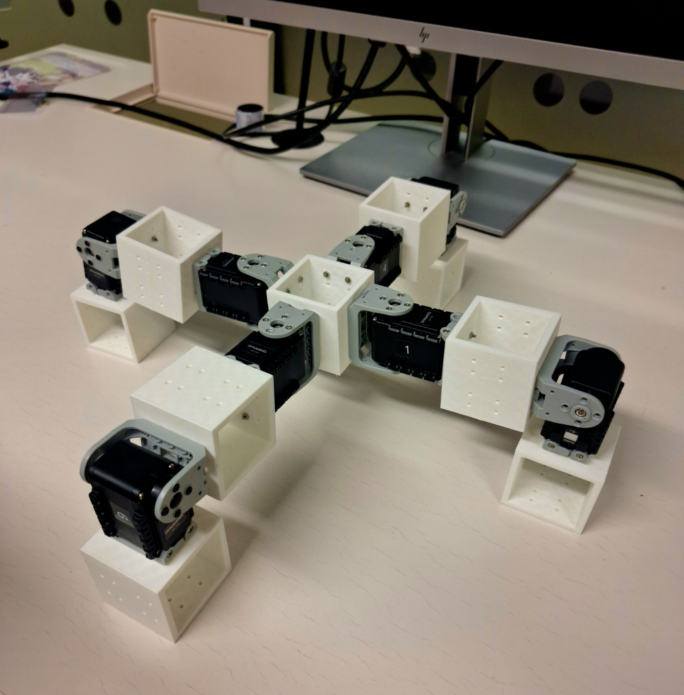
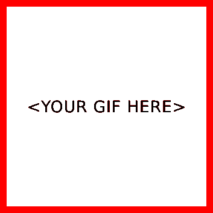

# Assignment 6 - IN5590
<!-- replace heading to name of prototype/robot -->
*By Your Name*

<!--delete from here-->
In this assignment we'll focus on (1) getting firmware/software to work
and (2) documentation for your robot.
<!-- ....to here-->

## 1) Firmware/software for the robot/prototype

<!-- delete from here-->
All the software for getting your prototype to work, should be put into `./src`. 

If you use Python, set up a `requirement.txt` that includes all the necessary modules.
<!-- ....to here-->

Setup instructions:
```
$ conda create --name <ENV_NAME> --file requirements.txt
$ conda activate <ENV_NAME>
```

Run instructions: 
```
$ python 
```

<!-- delete from here-->
**Deliverables:** Source code in `./src` and setup/run instructions in this README.
<!-- ....to here-->

## 2) Images from testing the robot

<!-- delete from here-->
Take a photo of the robot/prototype in operation. Additionally, make a GIF that shows 
the robot moving.
<!-- ....to here-->

[](./poster/main.pdf)

[](./poster/main.pdf)

<!-- delete from here-->
**GIF instructions:** Make a GIF that shows the prototype working. The GIF should:

- Not be more than 10 seconds long.
- Not be more than 25MB.
- Be 1:1 ratio.

FFmpeg can help you with the enlisted requirements. Here is a starting point:

```
ffmpeg -i IMG_4730.MOV -t 10s -vf 'crop=600:600' -r 15  output/1.gif
```
**Deliverables:** Image and GIF showing the robot in action as `./poster/images/2.png` and `./poster/images/2.gif`.

## 3) Poster

Create a poster based on the template in `./poster/`. 
There are some instructions in `./poster/README.md` in how to use the poster template.

Make a QR code that links to this github repo. See tip in `./poster/README.md`

We will hang all the posters in the common area in ROBIN after the deadline.

**Deliverables:** A nicely formatted/camera ready poster as `./poster/main.pdf`. Include all `.tex`-files and images in `./poster/` and `./poster/images/` so the PDF is reproducable. 
<!-- ....to here-->

Read more on my poster about the robot [here](./poster/main.pdf). For information on
CAD files, go to [this repo](link to assignment 5).


<!-- delete from here to end of file -->

Replace `(link to assignment 5)` with link to *your* assignment 5.

## Deliverables

Remove or comment out all the text in this README labeled with: 

``` html
<!-- delete from here-->
some text
<!-- ....to here-->
```

Feel free to use LLMs such as [ChatGPT](https://gpt.uio.no/) to generate text, but keep in mind that you are responsible for the content.
