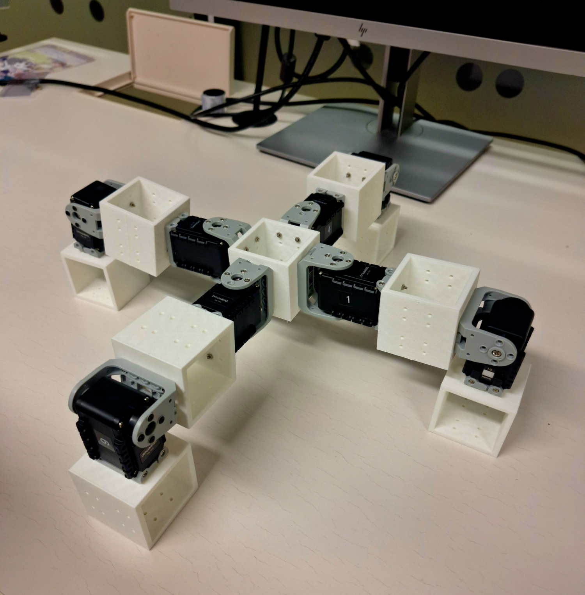
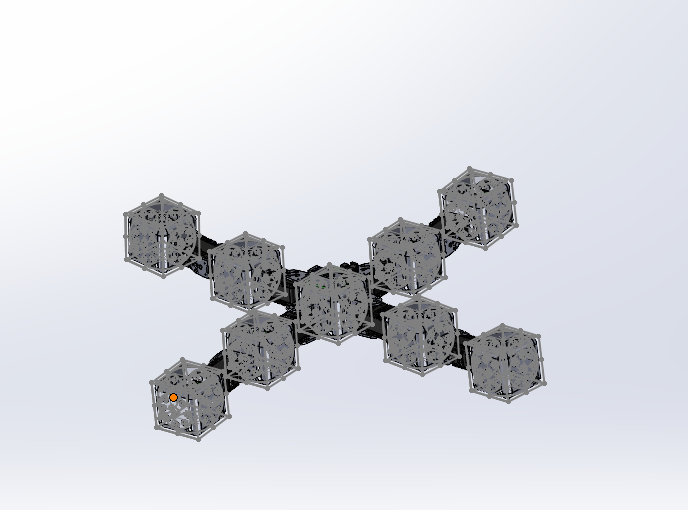
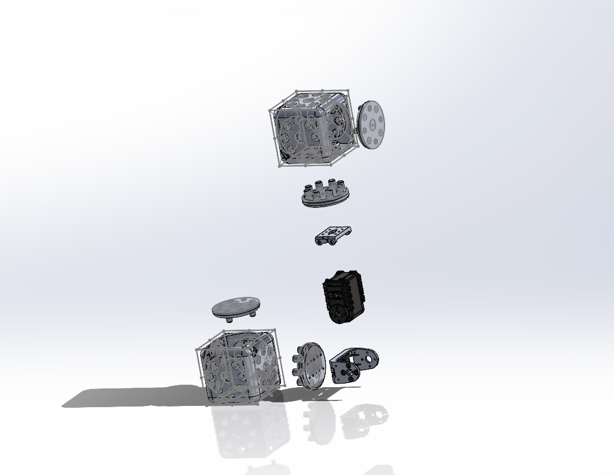
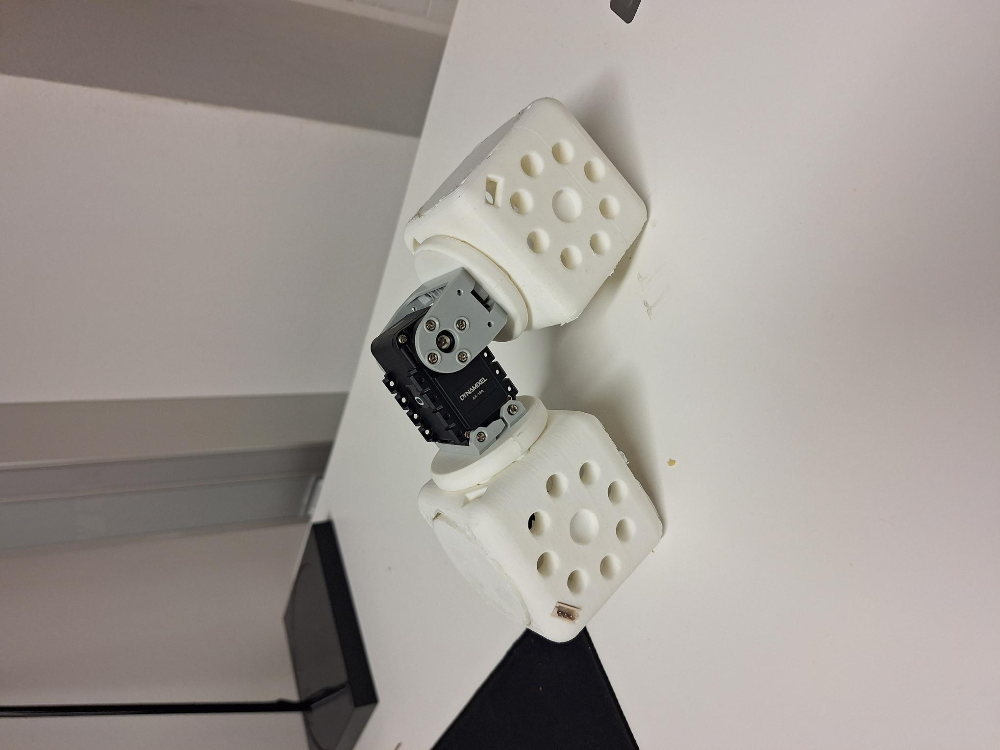
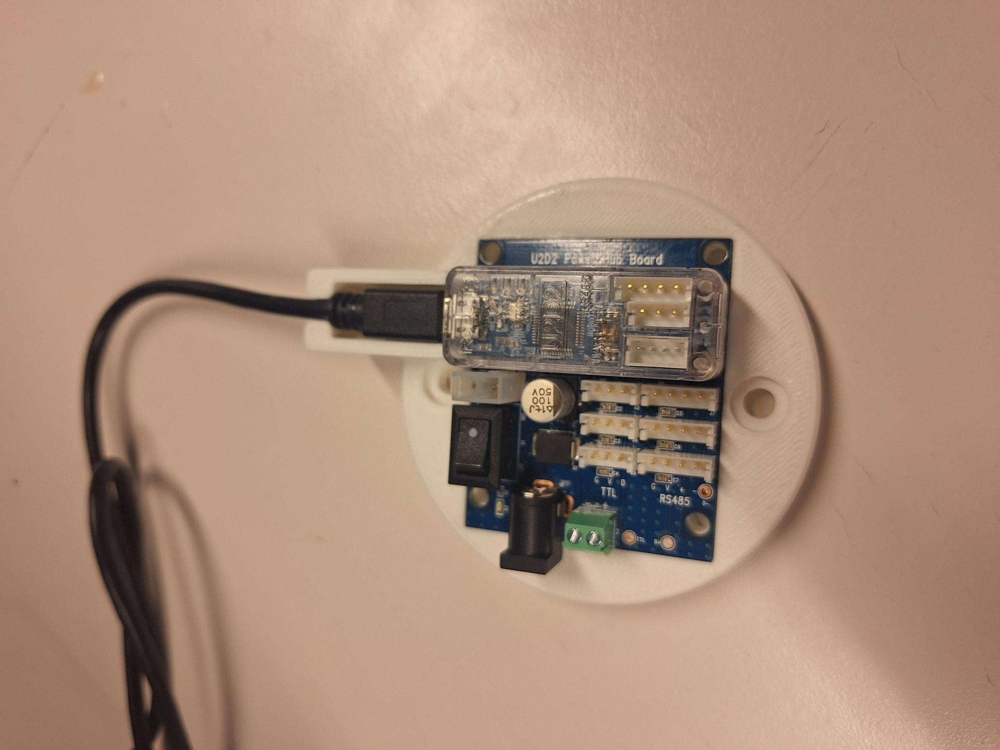

# The MATS - Modular Actuated Transforming System

MATS (Modular Actuated Transforming System) is a modular robot with two types of modules: Brick modules for connections and Joint modules with actuated servos. Unlike many modular robots, MATS allows easier morphology changes without manual disassembly and reassembly for each configuration.

The cable management of robotic systems like this can often also become messy, with wires running between modules. This project focused on creating a clean, efficient system with screw-free, robust connections to simplify assembly and maintain functionality. A unique feature of this robot is the absence of core modules; all Brick modules are identical, simplifying assembly and ensuring consistent functionality. I focused on a minimalist yet functional design to simplify manufacturing while ensuring intuitive use and visual appeal, covering both the fastening mechanism and cable management.

The modules are inspired by Revolve2, which is a framework focusing on modular robotics. The software used
to directly control the robot is the Dynamixel SDK, a software development kit that supports multiple programming tools and languages, including Python and ROS. For this project, I programmed the robot’s movements using Python and tested various custom movements that I developed. The robot communicates directly with a PC via a U2D2 USB communication converter.

This project developed a durable, visually appealing modular robot with easy-to-assemble modules, seamless connections, and efficient cable management. Its minimalist design simplifies use and supports future advancements in modular robotics.


# Tools and bill of materials

The following components were used in the development of MATS:

- U2D2 USB communication converter
- U2D2 Power Hub Board
- Dynamixel AX-18A servo
- 3D printed modules with PLA and ABS (designed with CAD in Solidworks)
- Neodym magnets

**Complete list of bill of materials:**

Main components:
| Item | Description      | Quantity 
| ---- | ---------------- | -------- 
| 1    | Robotis U2D2 USB communication converter | 1     
| 2    | Robotis U2D2 Power Hub Board | 1   
| 3    | Dynamixel AX-18A servo | 8

Mounting components:
| Item | Description      | Quantity 
| ---- | ---------------- | -------- 
| 1    | Dynamixel-AX Bioloid FP04-F2 frame | 8     
| 2    | Dynamixel-AX Bioloid FP04-F3 frame | 8 
| 3    | RS PRO Neodym magnet 2.09 kg - 12 mm | 52

Connectors and wiring:
| Item | Description      | Quantity 
| ---- | ---------------- | -------- 
| 1    | Robotis 3P Extension PCB | 9 
| 2    | 3P Molex male to female adapter| 36 
| 3    | Self-assembled 3P Molex cable 4 cm | 36   
| 4    | Self-assembled 3P Molex cable 8 cm | 16   
| 5    | Self-assembled 3P Molex cable 18 cm | 16
| 6    | Self-assembled 3P Molex cable 50 - 100 cm | 1  
| 7    | Micro USB cable | 1  

Fasteners:
| Item | Description      | Quantity 
| ---- | ---------------- | -------- 
| 1    | Bioloid Plastic Busher BPF-BU| 8 
| 2    | Bioloid Plastic Washer BPF-WA| 8
| 3    | M3 bolts| 8
| 4    | M2 screws | 164
| 5    | M2 nuts | 32  

## Firmware/software for the robot/prototype

Set up the environment:
```
$ conda create --name mats_env --file requirements.txt
$ conda activate mats_env
```
After installation, make sure:
- U2D2 Power Hub Board is turned ON and connected to the robot
- USB from the U2D2 is connected to your computer to the right port

Then you can run your Python files from the src folder with examples:
```
python breakdance.py
python wake_up.py
python dance.py
```

## Images from testing the robot



**Spider configuration of the modular robot using first generation Brick modules.**

<br>
<br>


**The spider configuration modular robot in action (*when running breakdance.py script*).**

<br>
<br>


**The latest generation of the Brick module ready for use.**

## CAD files





## 3D-print





| Part  | Material        | Quantity | Infill   | Layer height
| ----- | --------------- | -------- | -------- | ------------
| Block module | ABS | 9  | 20 % | 0.2 mm      
| Servo holder | ABS | 16  | 20 % | 0.2 mm       
| Lid | PolyMaker PLA | 18  | 20 % | 0.2 mm       
| Power Hub Board base | PolyMaker PLA | 1  | 20 % | 0.2 mm     
