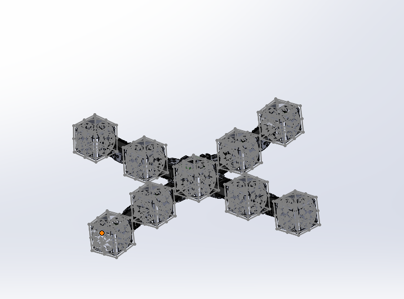

# Assignment 5 - IN5590
*Part 2 of 4 of the main project*

In this assignment you will make the physical robot from assignment 4. 

On [October 25](https://www.uio.no/studier/emner/matnat/ifi/IN5590/h24/timeplan/index.html#FOR)
we arrange a **mandatory status update** for your projects. Each student will have 3 minutes for the 
demonstration. The content should be:

- What you are making.
- How is it meant to work.
- Where are you now.
- What do you have left.
- Which issues have you faced

Bring the prototype.

## 1) CAD files

All SolidWorks-files should be put in directory: `./solidworks/`, including part and assembly files.

An image with side-by-side assambled part and exploded view, should be added as `./output/1.png`
Create two snapshots that illustrates the robot/prototype:
 - One with the entire assembled robot.
 - One png using the [exploaded view feature in SolidWorks](https://help.solidworks.com/2022/english/SolidWorks/sldworks/c_Exploded_Views_in_Assemblies.htm).

**Deliverables:** SolidWorks files including assembly and partfiles in `./solidworks/` directory. `./output/1assembled.PNG` and `./output/1exploded.PNG` snapshots.

## 2) 3D-print

3D-print all the parts and take a photo of the robot once it is assembled.

Make a table of 3D-printer material used, infill and layer hight for all your parts. 
If you use the same setting for everything, use one row.

| Part  | Material        | Quantity | Infill   | Layer hight
| ----- | --------------- | -------- | -------- | ------------
| Block module | [PolyMaker PLA](https://docs.rs-online.com/b4bb/A700000006921793.pdf) | 9  | 20 % | .15 mm      
| Servo holder | [PolyMaker PLA](https://docs.rs-online.com/b4bb/A700000006921793.pdf) | 16  | 20 % | .15 mm     

**Deliverables:** Image of the physical prototype as `./output/2physical_prototype.jpg` and table with 3D-print instructions.

## 3) Bill of materials

Create a table with the most important components for your setup. 

| Item | Description      | Quantity 
| ---- | ---------------- | -------- 
| 1    | U2D2 Power Hub Board | 1     
| 2    | 3P Extension PCB | 9     
| 3    | Dynamixel AX18 | 8     
| 4    | FP04-F2 | 8     
| 5    | FP04-F3 | 8 
| 6    | Neodym magnets | 52     

