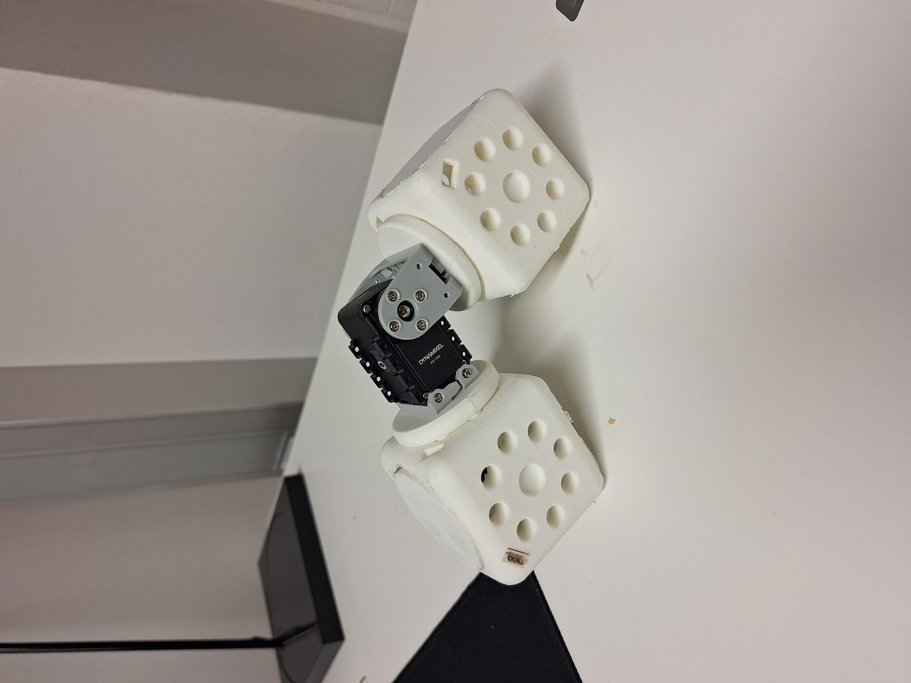

# Assignment 5 - IN5590
*Part 2 of 4 of the main project*

## 1) CAD files

## 2) 3D-print

| Part  | Material        | Quantity | Infill   | Layer hight
| ----- | --------------- | -------- | -------- | ------------
| Block module | ABS | 9  | 20 % | 0.2 mm      
| Servo holder | ABS | 16  | 20 % | 0.2 mm       
| Lid | PolyMaker PLA | 19  | 20 % | 0.2 mm       
| Power Hub Board base | PolyMaker PLA | 1  | 20 % | .15 mm     

## 3) Bill of materials

Main components:
| Item | Description      | Quantity 
| ---- | ---------------- | -------- 
| 1    | Robotis U2D2 USB communication converter | 1     
| 2    | Robotis U2D2 Power Hub Board | 1   
| 3    | Dynamixel AX-18A servo | 8

Mounting components:
| Item | Description      | Quantity 
| ---- | ---------------- | -------- 
| 1    | Dynamixel-AX Bioloid FP04-F2 frame | 8     
| 2    | Dynamixel-AX Bioloid FP04-F3 frame | 8 
| 3    | RS PRO Neodym magnet 2.09 kg - 12 mm | 52

Connectors and wiring:
| Item | Description      | Quantity 
| ---- | ---------------- | -------- 
| 1    | Robotis 3P Extension PCB | 9 
| 2    | 3P Molex male to female adapter| 36 
| 3    | Self-assembled 3P Molex cable 4 cm | 36   
| 4    | Self-assembled 3P Molex cable 8 cm | 16   
| 5    | Self-assembled 3P Molex cable 18 cm | 16
| 6    | Self-assembled 3P Molex cable 50 - 100 cm | 1  
| 7    | Micro USB cable | 1  

Fasteners:
| Item | Description      | Quantity 
| ---- | ---------------- | -------- 
| 1    | Bioloid Plastic Busher BPF-BU| 8 
| 2    | Bioloid Plastic Washer BPF-WA| 8
| 3    | M3 bolts| 8
| 4    | M2 screws | 164
| 5    | M2 nuts | 32  

Extra if time:
| Item | Description      | Quantity 
| ---- | ---------------- | -------- 
| 1    | LED lights inside Block modules| 18 
| 2    | Lazer cutted logo on Block module lid| 18
| 3    | Small thin magnets on lid under logo| 72
| 4    | 3D printed mating-adapter to connect two block-modules| 4-8
| 5    | 3D printed mating-adapter to connect two servo-modules| 4-8

